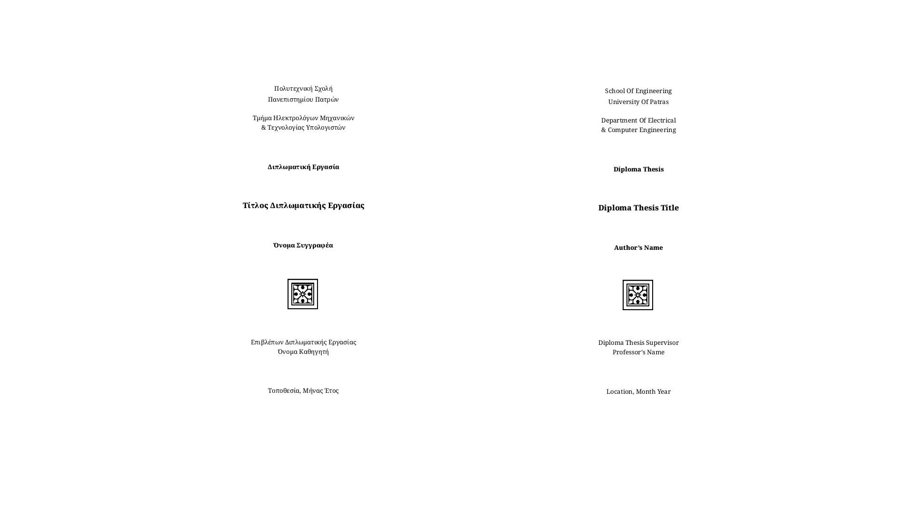

# Diploma Thesis Template



## Instructions for Use

The best way to use this template is to download it as a zip file and upload it as it is (as a zip file) to Overleaf.Overleaf is an online LaTeX editor and has pre-installed all the necessary packages to compile this template into a PDF file.

Should you decide to proceed with this method then, once you sign in to your Overleaf account, you must open the Menu button on the top left corner and choose `XeLaTeX` as the compiler and the `Thesis.tex` as the main document.

## Configuration Options

1. The default language for the template is English. If you want to change it to Greek for example, then configure the `babel` package in the `Preamble.sty` as following:

	```
	\RequirePackage[english, greek]{babel}
	```

	By doing so, you declare that there will be two languages in the document, Greek and English, with the Greek being the default one. Note that in the `babel` package the active language is the last one.
