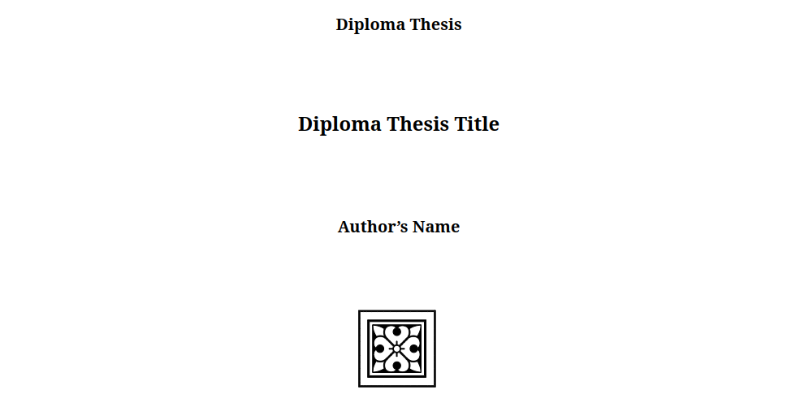

# Monograph



## Introduction

Monograph is a template, suitable mainly for diploma theses and doctoral dissertations.
To see the final compiled document, open the `Monograph.pdf` file in this repository.

## Instructions for Use

The best way to use this template is to download it as a zip file and then upload it as it is (as a zip file) to Overleaf.
Overleaf is an online LaTeX editor and has pre-installed all the necessary packages to compile this template into a PDF file.

Should you decide to proceed with this method then, then once you sign in to your Overleaf account, press the Menu button on the top left corner and choose `XeLaTeX` (or `LuaLaTeX`), as well as the `Monograph.tex` as the main document.

## Configuration Options

1. The default language for the template is English. If you want to change it, for example to Greek, then configure the `babel` package in the `Preamble.sty` as following:

    ```
    \RequirePackage[english, greek]{babel}
    ```

By doing so, you declare that there will be two languages in the document, Greek and English, with the Greek being the default one.
Note that in the `babel` package the active language is the last one.

## Available Support

If you need support regarding using this tempalte, or you find any misconfigurations that result in errors, feel free to create an [issue](https://github.com/Adam-Antios/monograph/issues).
I can't guarantee that I will help, or that I will implement any changes, but I will try my best to do so.

## How to Reference

If you use this template, you can reference it by copying the following text and pasting it in your document.

This work has been created using the Monograph LaTeX template:

https://github.com/Adam-Antios/monograph

MIT License

Copyright (c) 2022 Adam-Antios (https://github.com/Adam-Antios)

Permission is hereby granted, free of charge, to any person obtaining a copy of this software and associated documentation files (the "Software"), to deal in the Software without restriction, including without limitation the rights to use, copy, modify, merge, publish, distribute, sublicense, and/or sell copies of the Software, and to permit persons to whom the Software is furnished to do so, subject to the following conditions:

The above copyright notice and this permission notice shall be included in all copies or substantial portions of the Software.

THE SOFTWARE IS PROVIDED "AS IS", WITHOUT WARRANTY OF ANY KIND, EXPRESS OR IMPLIED, INCLUDING BUT NOT LIMITED TO THE WARRANTIES OF MERCHANTABILITY, FITNESS FOR A PARTICULAR PURPOSE AND NONINFRINGEMENT. IN NO EVENT SHALL THE AUTHORS OR COPYRIGHT HOLDERS BE LIABLE FOR ANY CLAIM, DAMAGES OR OTHER LIABILITY, WHETHER IN AN ACTION OF CONTRACT, TORT OR OTHERWISE, ARISING FROM, OUT OF OR IN CONNECTION WITH THE SOFTWARE OR THE USE OR OTHER DEALINGS IN THE SOFTWARE.
